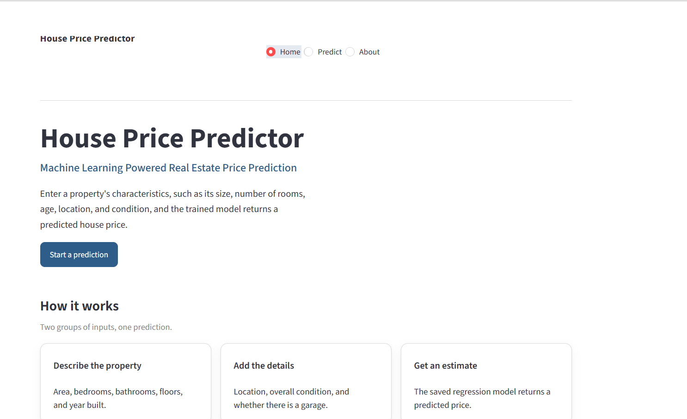
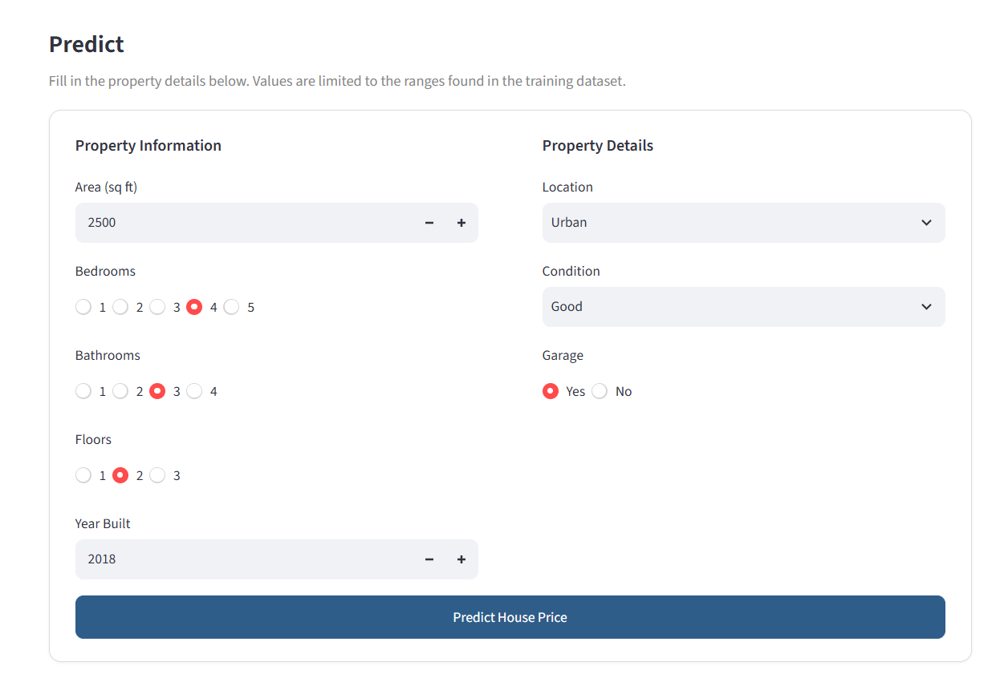
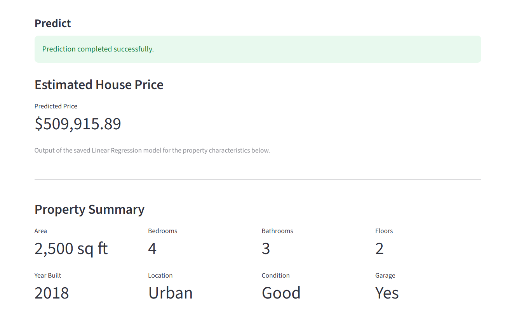
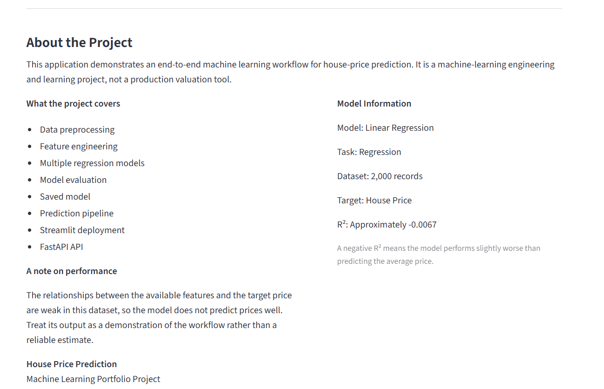

# House Price Prediction

[](https://house-price-predictor-robel.streamlit.app/)
[](https://house-price-api-7y5w.onrender.com/docs)
[](https://www.python.org/)
[](https://scikit-learn.org/)

A complete end-to-end Machine Learning project that predicts house prices from property characteristics using Python, Scikit-learn, Streamlit, and FastAPI.

The project covers the complete machine learning workflow from data analysis and model training to a web interface, REST API, model serialization, and cloud deployment.

---

## Live Applications

### Streamlit Web Application

The interactive house price prediction application is publicly deployed through Streamlit Community Cloud.

**Live Demo:**

https://house-price-predictor-robel.streamlit.app/

### FastAPI REST API

The machine learning API is publicly deployed through Render.

**Live API:**

https://house-price-api-7y5w.onrender.com

**Interactive API Documentation:**

https://house-price-api-7y5w.onrender.com/docs

The FastAPI deployment provides:

- `GET /health` — API health check
- `POST /predict` — House price prediction
- `/docs` — Interactive Swagger/OpenAPI documentation

---

## Project Overview

The goal of this project is to build a machine learning system that predicts the estimated price of a house based on:

- Area
- Bedrooms
- Bathrooms
- Floors
- Year Built
- Location
- Condition
- Garage availability

The project uses the Kaggle **House Price Prediction Dataset**, containing 2,000 records.

The project demonstrates the complete workflow of taking a machine learning model from experimentation in notebooks to a structured application, REST API, and cloud deployment.

---

## Application Screenshots

### Home Page



### Prediction Page



### Prediction Result



### About Page



---

## Features

- House price prediction
- Data preprocessing
- Exploratory data analysis
- Categorical feature encoding
- Train/test splitting
- Multiple machine learning models
- Model evaluation
- Model comparison
- Final model serialization
- Scikit-learn prediction pipeline
- Streamlit web application
- FastAPI REST API
- Pydantic input validation
- Local prediction pipeline
- Cloud deployment
- Interactive API documentation
- Professional project structure
- Git/GitHub version control

---

## Machine Learning Workflow

The project follows an end-to-end machine learning workflow:

```text
Problem Definition
        ↓
Dataset Understanding
        ↓
Data Quality Audit
        ↓
Data Cleaning
        ↓
Exploratory Data Analysis
        ↓
Feature Engineering
        ↓
Train/Test Split
        ↓
Preprocessing Pipeline
        ↓
Baseline Model
        ↓
Multiple ML Models
        ↓
Model Evaluation
        ↓
Model Comparison
        ↓
Final Model
        ↓
Model Serialization
        ↓
Prediction Pipeline
        ↓
Streamlit Application
        ↓
FastAPI REST API
        ↓
Cloud Deployment
```

---

## Dataset

**Dataset:** House Price Prediction Dataset

**Number of records:** 2,000

### Features

| Feature   | Description              |
| --------- | ------------------------ |
| Area      | House area               |
| Bedrooms  | Number of bedrooms       |
| Bathrooms | Number of bathrooms      |
| Floors    | Number of floors         |
| YearBuilt | Year the house was built |
| Location  | Property location        |
| Condition | Property condition       |
| Garage    | Garage availability      |
| Price     | Target variable          |

The `Id` column was removed because it does not provide meaningful predictive information for the model.

---

## Data Preprocessing

Categorical variables were converted into numerical features using one-hot encoding.

The final encoded feature set contains:

```text
Area
Bedrooms
Bathrooms
Floors
YearBuilt
Location_Rural
Location_Suburban
Location_Urban
Condition_Fair
Condition_Good
Condition_Poor
Garage_Yes
```

Reference categories were excluded to avoid redundant dummy variables.

The final feature matrix contains:

```text
2000 samples
12 features
```

The dataset was divided into:

```text
Training set: 80% → 1600 samples
Testing set: 20% → 400 samples
```

The preprocessing logic is integrated into the Scikit-learn pipeline so that the same transformations are applied during training and prediction.

---

## Models Evaluated

Several regression models were evaluated:

- Baseline
- Linear Regression
- Decision Tree
- Random Forest
- Gradient Boosting
- XGBoost
- LightGBM
- CatBoost

### Evaluation Metrics

The main evaluation metrics were:

- **MAE** — Mean Absolute Error
- **MSE** — Mean Squared Error
- **RMSE** — Root Mean Squared Error
- **R²** — Coefficient of Determination

### Current Results

| Model             |        MAE |       RMSE |      R² |
| ----------------- | ---------: | ---------: | ------: |
| Baseline          | 252,671.95 | 292,329.63 | -0.0984 |
| Linear Regression | 243,241.98 | 279,859.73 | -0.0067 |
| Decision Tree     | 329,752.94 |          — | -1.0805 |
| Random Forest     | 252,671.95 |          — | -0.0984 |
| Gradient Boosting | 245,284.36 |          — | -0.0355 |
| XGBoost           | 248,001.52 |          — |       — |
| LightGBM          | 247,034.45 | 285,070.30 | -0.0446 |
| CatBoost          | 244,376.78 |          — |       — |

The final model used by the deployed application is **Linear Regression**.

---

## Important Dataset Limitation

The dataset appears to contain relatively weak relationships between the available input features and the target price.

Exploratory analysis showed very weak correlations between several numerical features and `Price`. This limits the predictive performance of the evaluated models.

The negative or near-zero R² values indicate that the models do not explain the target variation particularly well on the available test data.

This demonstrates an important machine learning lesson:

> **Model complexity cannot compensate for weak or uninformative data relationships.**

The project therefore focuses not only on prediction performance, but also on demonstrating the complete machine learning engineering workflow from data preparation through deployment.

---

## Project Structure

```text
House_Price_Prediction/
│
├── api/
│   ├── __init__.py
│   └── main.py
│
├── app/
│   └── app.py
│
├── data/
│   └── House Price Prediction Dataset.csv
│
├── images/
│   ├── home.png
│   ├── predict.png
│   ├── result.png
│   └── about.png
│
├── models/
│   └── final_model.pkl
│
├── notebooks/
│   ├── House_Price_Prediction.ipynb
│   └── all_in_one.ipynb
│
├── src/
│   ├── __init__.py
│   ├── config.py
│   ├── evaluate.py
│   ├── predict.py
│   ├── preprocessing.py
│   └── train.py
│
├── README.md
└── requirements.txt
```

---

## Technology Stack

### Machine Learning

- Python
- Pandas
- NumPy
- Scikit-learn
- XGBoost
- LightGBM
- CatBoost

### Application

- Streamlit

### API

- FastAPI
- Pydantic
- Uvicorn

### Development

- Jupyter Notebook
- Git
- GitHub

### Deployment

- Streamlit Community Cloud
- Render

---

## Running the Project Locally

### 1. Clone the repository

```bash
git clone https://github.com/robelgher16-ai/MACHINE_LEARNING_PROJECTS.git
```

### 2. Navigate to the project

```bash
cd MACHINE_LEARNING_PROJECTS/House_Price_Prediction
```

### 3. Create a virtual environment

```bash
python -m venv .venv
```

### 4. Activate the environment

PowerShell:

```powershell
.venv\Scripts\Activate.ps1
```

### 5. Install dependencies

```bash
pip install -r requirements.txt
```

---

## Run the Streamlit Application

From the `House_Price_Prediction` directory:

```bash
streamlit run app/app.py
```

The application provides:

- Home page
- Prediction form
- Prediction result
- About page

### Live Application

https://house-price-predictor-robel.streamlit.app/

---

## Run the FastAPI Application

From the `House_Price_Prediction` directory:

```bash
uvicorn api.main:app --reload
```

The local API will be available at:

```text
http://127.0.0.1:8000
```

### Local API Documentation

```text
http://127.0.0.1:8000/docs
```

### Health Check

```text
GET /health
```

Expected response:

```json
{
  "status": "ok"
}
```

### Prediction Endpoint

```text
POST /predict
```

---

## FastAPI Example Request

```json
{
  "area": 2500,
  "bedrooms": 4,
  "bathrooms": 3,
  "floors": 2,
  "year_built": 2018,
  "location": "Urban",
  "condition": "Good",
  "garage": "Yes"
}
```

### Example Response

```json
{
  "predicted_price": 550000.0
}
```

The exact predicted value depends on the trained model and input data.

---

## Production API

The FastAPI backend is deployed on Render.

### API Base URL

```text
https://house-price-api-7y5w.onrender.com
```

### API Documentation

```text
https://house-price-api-7y5w.onrender.com/docs
```

### Available Endpoints

| Method | Endpoint   | Purpose                           |
| ------ | ---------- | --------------------------------- |
| GET    | `/health`  | Check API status                  |
| POST   | `/predict` | Predict house price               |
| GET    | `/docs`    | Interactive Swagger documentation |

---

## Model Pipeline

The application uses a saved Scikit-learn pipeline containing preprocessing and the final regression model.

```text
Input Data
    ↓
Preprocessing
    ↓
Categorical Encoding
    ↓
Linear Regression
    ↓
Predicted House Price
```

The trained pipeline is stored in:

```text
models/final_model.pkl
```

The prediction function loads the saved pipeline and applies the same preprocessing used during model training.

---

## API Architecture

The FastAPI backend provides a REST interface for making house price predictions.

```text
Client
  ↓
FastAPI
  ↓
Pydantic Validation
  ↓
Prediction Function
  ↓
Saved ML Pipeline
  ↓
Predicted Price
  ↓
JSON Response
```

The API validates incoming values such as:

- Area range
- Number of bedrooms
- Number of bathrooms
- Number of floors
- Year built
- Location
- Condition
- Garage availability

---

## Deployment Architecture

The complete deployed system consists of two public services:

```text
                    User
                     │
                     ├─────────────────────┐
                     │                     │
                     ▼                     ▼
          Streamlit Application      FastAPI REST API
          Streamlit Cloud                 Render
                     │                     │
                     └──────────┬──────────┘
                                ▼
                         Saved ML Pipeline
                                │
                                ▼
                         House Price Prediction
```

### Public Services

**Streamlit Application**

https://house-price-predictor-robel.streamlit.app/

**FastAPI API**

https://house-price-api-7y5w.onrender.com

**FastAPI Documentation**

https://house-price-api-7y5w.onrender.com/docs

---

## Learning Objectives

This project demonstrates practical understanding of:

- Data preprocessing
- Exploratory data analysis
- Feature engineering
- Categorical encoding
- Train/test splitting
- Regression
- Model evaluation
- Model comparison
- Machine learning pipelines
- Model serialization
- Prediction systems
- Streamlit development
- REST API development
- Input validation
- Cloud deployment
- Git/GitHub project management

---

## Future Improvements

Possible improvements include:

- Hyperparameter optimization
- More informative real-world housing data
- Additional feature engineering
- Cross-validation
- Error analysis
- SHAP explainability
- Improved feature collection
- Model monitoring
- Automated model retraining
- API authentication
- CI/CD automation
- Improved production infrastructure

---

## Project Status

| Component                    | Status    |
| ---------------------------- | --------- |
| Machine Learning Pipeline    | Completed |
| Data Preprocessing           | Completed |
| Exploratory Data Analysis    | Completed |
| Model Comparison             | Completed |
| Prediction Pipeline          | Completed |
| Streamlit Web Application    | Completed |
| FastAPI REST API             | Completed |
| Screenshots                  | Completed |
| GitHub Documentation         | Completed |
| Streamlit Cloud Deployment   | Live      |
| FastAPI Render Deployment    | Live      |
| Public Streamlit Application | Available |
| Public FastAPI API           | Available |
| Swagger API Documentation    | Available |

### Live Demo

**Streamlit Application**

https://house-price-predictor-robel.streamlit.app/

**FastAPI API**

https://house-price-api-7y5w.onrender.com

**FastAPI Swagger Documentation**

https://house-price-api-7y5w.onrender.com/docs

---

## Author

**Robel Gebregziabher**

Information Technology Student

### Focus Areas

Machine Learning • Deep Learning • Generative AI • AI Engineering

### GitHub

https://github.com/robelgher16-ai

### Live Application

https://house-price-predictor-robel.streamlit.app/

### Live API

https://house-price-api-7y5w.onrender.com
