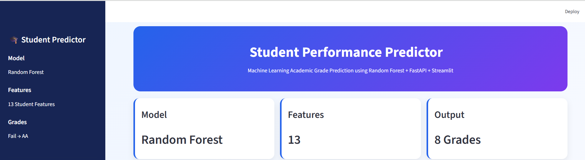
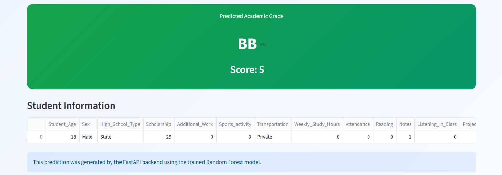
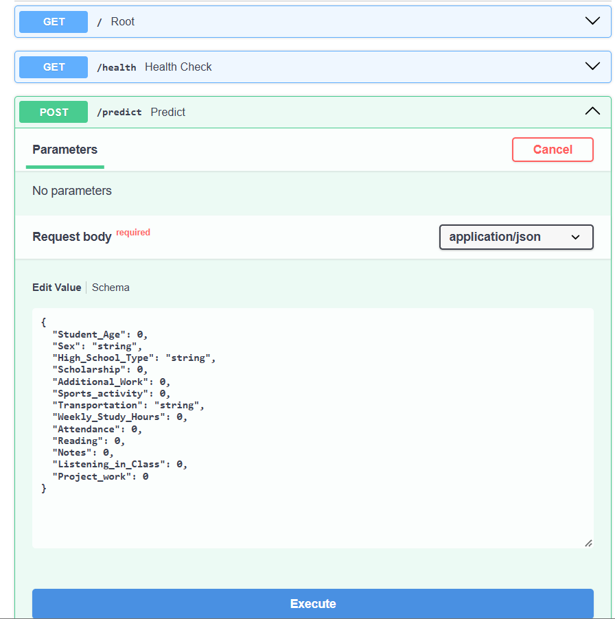

# 🎓 Student Performance Predictor

An end-to-end Machine Learning project that predicts a student's final academic grade using demographic information, attendance, study habits, scholarship status, and classroom behavior.

The project includes data analysis, preprocessing, model training, evaluation, explainable AI, a FastAPI prediction API, and a Streamlit web application.

---

## 🚀 Live Demo

### Streamlit Application

[Open the Student Performance Predictor App](https://machinelearningprojects-roble.streamlit.app/)

### FastAPI Backend

[Open the FastAPI Backend](https://student-performance-api-3rxe.onrender.com)

### FastAPI Documentation

[Open Swagger API Documentation](https://student-performance-api-3rxe.onrender.com/docs)

---

## 🏗️ System Architecture

```text
User
 │
 ▼
Streamlit Web Application
 │
 │ HTTPS Request
 ▼
FastAPI Prediction API
 │
 ▼
Random Forest Model
 │
 ▼
Predicted Student Grade
```

The Streamlit application provides the user interface, while the FastAPI service hosted on Render handles model inference.

---

## 🚀 Project Features

- Data Cleaning & Validation
- Exploratory Data Analysis (EDA)
- Statistical Analysis
- Feature Engineering
- Machine Learning Pipelines
- Cross Validation
- Hyperparameter Tuning
- Model Evaluation
- Feature Importance Analysis
- SHAP Explainable AI
- FastAPI Prediction API
- Interactive Swagger API Documentation
- Streamlit Web Application
- Cloud Deployment

---

## 📊 Dataset

- **Rows:** 145 students
- **Features:** 13
- **Target:** Grade
- **Grade Range:** Fail → AA

### Grade Mapping

| Grade | Score |
| ----- | ----: |
| Fail  |     0 |
| DD    |     1 |
| DC    |     2 |
| CC    |     3 |
| CB    |     4 |
| BB    |     5 |
| BA    |     6 |
| AA    |     7 |

---

## 🤖 Models Trained

The project evaluates multiple regression models:

- Linear Regression
- Ridge Regression
- Lasso Regression
- Decision Tree
- Random Forest
- Gradient Boosting
- Extra Trees
- XGBoost
- LightGBM

### Best Model

**Random Forest Regressor**

| Metric | Value |
| ------ | ----: |
| MAE    |  1.83 |
| RMSE   |  2.23 |
| R²     | 0.087 |

---

## 🧠 Explainable AI

The project includes SHAP-based analysis to understand feature contributions and model behavior.

Generated explainability artifacts include:

- SHAP feature importance
- SHAP summary visualization
- SHAP waterfall visualization
- SHAP values

These results help analyze which student-related features contribute to model predictions.

---

## 🌐 Deployment

### Streamlit

The frontend is deployed as a Streamlit web application.

It provides an interactive interface where users can enter student information and receive a predicted grade.

### FastAPI + Render

The trained model is served through a FastAPI backend deployed on Render.

The API provides:

- Prediction endpoint
- Input validation
- Model inference
- Swagger API documentation

### Deployment Flow

```text
Streamlit Cloud
      │
      │ HTTPS
      ▼
Render FastAPI
      │
      ▼
Random Forest Model
      │
      ▼
Prediction
```

---

## 📸 Application Screenshots

### 1. Home Page



### 2. Student Input


### 3. Prediction Result



### 4. FastAPI Swagger Documentation



---

## 📁 Project Structure

```text
Student_Performance_Predictor/
│
├── app.py
├── requirements.txt
├── README.md
│
├── api/
│   ├── __init__.py
│   └── main.py
│
├── assets/
│   ├── 01_home.png
│   ├── 02_upload.png
│   ├── 03_prediction.png
│   └── 04_swagger.png
│
├── data/
│   └── raw/
│       └── Students_Performance.csv
│
├── models/
│   ├── best_classifier.pkl
│   ├── best_model.pkl
│   └── best_random_forest_tuned.pkl
│
├── notebooks/
│   ├── 01_EDA.ipynb
│   ├── 02_Preprocessing.ipynb
│   ├── 03_Model_Training.ipynb
│   └── 04_Evaluation.ipynb
│
├── reports/
│   ├── classification_confusion_matrix.csv
│   ├── classification_cv_results.csv
│   ├── classification_metrics.csv
│   ├── feature_importance.csv
│   ├── feature_importance.png
│   ├── shap_bar.png
│   ├── shap_importance.csv
│   ├── shap_summary.png
│   ├── shap_values.csv
│   └── shap_waterfall.png
│
└── src/
    ├── analyze_data.py
    ├── classification_train.py
    ├── data_cleaning.py
    ├── evaluate.py
    ├── hyperparameter_tuning.py
    ├── predict.py
    ├── preprocessing.py
    ├── shap_analysis.py
    ├── statistical_analysis.py
    ├── train.py
    └── utils.py
```

---

## ▶️ Run Locally

### 1. Clone the repository

```bash
git clone https://github.com/robelgher16-ai/MACHINE_LEARNING_PROJECTS.git
cd MACHINE_LEARNING_PROJECTS/Student_Performance_Predictor
```

### 2. Create and activate a virtual environment

```bash
python -m venv .venv
```

Windows:

```bash
.venv\Scripts\activate
```

### 3. Install dependencies

```bash
pip install -r requirements.txt
```

### 4. Run the FastAPI backend

```bash
uvicorn api.main:app --reload
```

The Swagger documentation will be available at:

```text
http://127.0.0.1:8000/docs
```

### 5. Run the Streamlit application

In another terminal:

```bash
streamlit run app.py
```

---

## 🛠️ Technologies Used

- Python
- Pandas
- NumPy
- Scikit-learn
- XGBoost
- LightGBM
- SHAP
- FastAPI
- Uvicorn
- Streamlit
- Joblib
- Git & GitHub
- Render
- Streamlit Cloud

---

## 👨‍💻 Author

**Robel Gebregziabher**

AI Engineering • Machine Learning • Deep Learning
